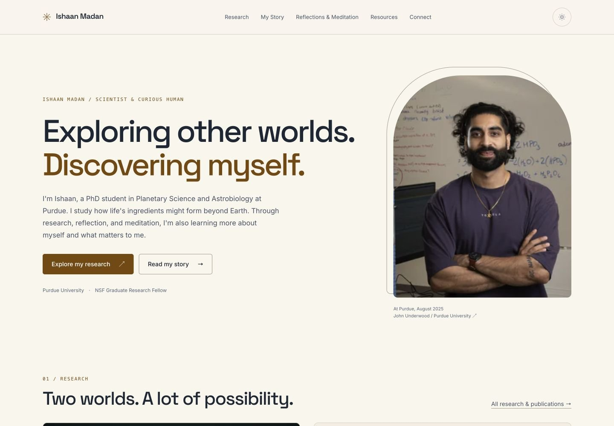

# Website experience review

Implemented September 5, 2026, on `codex/website-experience`, starting from `main` at `2c626b1`. The latest Titan ammonia-slider fixes are included. This change is for PR review; no production deployment or merge was performed.

## What visitors can now do

The homepage introduces Ishaan before asking visitors to choose between research, his story, reflection, useful resources, and connecting. Each research project has a short orientation with his contribution, findings, limitations, publications, and a direct route into the full interactive companion. The companions and retreat article now share site navigation, chapters, metadata, and onward reading.

My Story contains the requested sentence exactly:

> At the center of it all has been one recurring pull: the process of self-discovery.

The full story timeline, retreat writing, scientific explanations, citations, existing resources, CVs, and contact destinations are retained. New summaries and connective copy are available for editorial review. The dated focus note is maintained manually in `src/data/editorial.ts`.

## Screenshots

Homepage captures show the full page; other page captures show the opening viewport. Desktop captures use 1440px width and mobile captures use 390px width.

| Page | Desktop | Mobile |
| --- | --- | --- |
| Original homepage | [Before](screenshots/before-home-desktop.jpg) | [Before](screenshots/before-home-mobile.jpg) |
| New homepage | [Dark](screenshots/home-desktop.jpg), [light](screenshots/home-light.jpg) | [Dark](screenshots/home-mobile.jpg) |
| Titan project | [View](screenshots/titan-project-desktop.jpg) | [View](screenshots/titan-project-mobile.jpg) |
| My Story | [View](screenshots/story-desktop.jpg) | [View](screenshots/story-mobile.jpg) |
| Reflections & Meditation | [View](screenshots/reflections-desktop.jpg) | [View](screenshots/reflections-mobile.jpg) |
| Titan interactive | [View](screenshots/titan-interactive-desktop.jpg) | [View](screenshots/titan-interactive-mobile.jpg) |
| Retreat reflection | [View](screenshots/retreat-desktop.jpg) | [View](screenshots/retreat-mobile.jpg) |

## Route migration

| Existing URL | Destination |
| --- | --- |
| `/interactive-science/` | `/research/` |
| `/interactive-science/titan.html` | `/research/titan/explore/` |
| `/interactive-science/venus-chemistry-story.html` | `/research/venus/explore/` |
| `/meditations/` | `/reflections/` |
| `/meditations/first-retreat-reflections.html` | `/reflections/first-retreat/` |
| `/work-with-me/` | `/connect/` |

The manifest also covers extensionless and trailing-slash variants: 15 old addresses total. All returned direct HTTP 301 responses to the intended destinations in the local Cloudflare Workers preview. A browser visit to the old Titan URL with `#gatekeeper-title` retained the fragment at the new route. Original article section IDs and image assets remain available.

## Verification

- `npm run build`: passed; 11 public pages generated.
- `npm run check`: passed across 45 files, with zero errors, warnings, or hints.
- `npm test`: passed; checks 11 pages, 367 internal links/assets, all 15 redirect mappings, unique headings/IDs, canonical and sharing metadata, JSON-LD, image dimensions/alternatives, preserved anchors, and exact story wording. Executes the actual science scripts to verify all seven Titan settings and Venus controls.
- Browser accessibility scans: all 11 pages in both themes, 22 axe-core scans against WCAG 2 A/AA and 2.1 AA tags, with zero automated violations after fixes. This is an automated result, not a claim of full accessibility conformance.
- Responsive review: all routes checked at 360, 768, and 1024px; representative pages additionally reviewed at 390 and 1440px. No horizontal overflow or broken loaded images was found. At 390 × 844, both homepage discovery actions appear before the portrait and within the first viewport.
- Keyboard review: Titan reaches 0, 1, 2, 3, 4, 5, and 10% ammonia with matching accessible values and reported counts. Venus environment selection and evidence disclosures respond to keyboard input. The mobile menu closes with Escape and restores focus.
- Progressive behavior: with scripts blocked, native navigation remains usable and static model explanations remain visible. Interactive controls appear only after their scripts initialize. Theme selection persists between ordinary page navigations.
- External destination checks: application folder, meditation playlist, and circle registration returned HTTP 200. Canva returned HTTP 403 to automated requests, so those existing slide links are preserved but their anonymous access still needs a human check.
- `git diff --check`: passed.

### Image payload comparison

These are actual file sizes, not estimates of page-load time. Published scientific plots were retained unchanged.

| Image group | Original bytes | New bytes | Reduction |
| --- | ---: | ---: | ---: |
| Portrait, 800px WebP | 393,546 | 34,326 | 91.3% |
| Five Titan illustrations | 12,452,761 | 275,770 | 97.8% |

Images have reserved dimensions; below-the-fold images are lazy loaded. Responsive portraits and page-specific sharing images are generated by `npm run og`.

### Limits and remaining manual review

The local browser did not supply usable Largest Contentful Paint measurements, so this report makes no Core Web Vitals or before/after page-speed claim. Field performance and real-user comprehension were not measured. Browser-native 200% zoom, an OS-level reduced-motion setting, and a full screen-reader walkthrough remain manual review items; responsive reflow was exercised and the reduced-motion stylesheet was inspected. Automated scans also leave some gradient contrast and ARIA context checks for manual assessment.

## Review locally

Run `npm install`, then `npm run preview` for the production build in a local Cloudflare runtime. Use `npm run review` in a second terminal to run the local accessibility review server at port 8788; append `?nojs` to inspect script-blocked reading. The review instrumentation is added only to local responses and is absent from production output.

The existing GitHub integration uses Cloudflare Workers Builds. An online branch preview depends on that integration's configuration; the committed screenshots and local preview do not require a new hosting service.

## Editorial review prompts

1. Does the introduction and self-discovery framing sound like Ishaan?
2. Are the descriptions of his individual contributions and current focus accurate?
3. Can someone unfamiliar with him explain one research question after a minute, find a useful resource, and describe something personal they learned?

These prompts can be used with three to five new readers. No invitations or messages were sent as part of this implementation.
